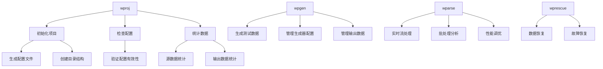

# CLI 工具集
本文档集合介绍 WarpParse提供的完整命令行工具集，包括数据解析、生成、项目管理等功能。

## 工具总览

### 核心工具

| 工具 | 功能描述 | 主要用途 |
|------|---------|---------|
| **wparse** | 数据解析引擎 | 实时数据流处理、批处理分析 |
| **wpgen** | 数据生成器 | 基于规则或样本生成测试数据 |
| **wproj** | 项目管理工具 | 项目初始化、配置管理、数据统计 |
| **wprescue** | 数据恢复工具 | 从救援目录恢复处理失败的数据 |

## 快速参考

### wparse - 数据解析引擎

```bash
# 守护进程模式（持续运行）
wparse daemon --work-root ./myproject --stat-print

# 批处理模式
wparse batch --work-root ./myproject --max-line 10000 --stat 5

```

### wpgen - 数据生成器

```bash
# 基于规则生成数据
wpgen rule --work-root ./myproject --print-stat --line-cnt 10000

# 基于样本生成数据
wpgen sample --work-root ./myproject --line-cnt 5000

# 配置管理
wpgen conf init
wpgen conf check
wpgen conf clean

# 数据管理
wpgen data clean
wpgen data check

```

### wproj - 项目管理工具

```bash
# 项目初始化
wproj init --mode full

# 项目检查
wproj check

# 数据清理
wproj data clean

# 统计功能
wproj stat file
wproj stat file --output json

# 模型管理
wproj model list
wproj model validate

# 规则工具
wproj rule parse --rule-id myrule
wproj rule test --input sample.log

# 配置管理
wproj sinks list
wproj sinks validate
wproj sinks route

```

### wprescue - 数据恢复工具

```bash
# 批处理模式恢复数据
wprescue batch --work-root ./myproject

```

## 工具关系图

