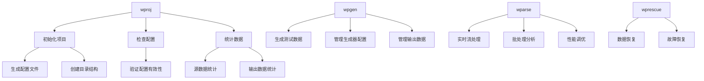

# CLI 工具集
本文档集合介绍 WarpParse提供的完整命令行工具集，包括数据解析、生成、项目管理等功能。

## 工具总览

### 核心工具

| 工具 | 功能描述 | 主要用途 |
|------|---------|---------|
| **wparse** | 数据解析引擎 | 实时数据流处理、批处理分析 |
| **wpgen** | 数据生成器 | 基于规则或样本生成测试数据 |
| **wproj** | 项目管理工具 | 项目初始化、配置管理、数据统计 |
| **wprescue** | 数据恢复工具 | 从救援目录恢复处理失败的数据 |

## 快速参考

### wparse - 数据解析引擎

```bash
# 守护进程模式（持续运行）
wparse daemon --work-root ./myproject --stat-print

# 批处理模式
wparse batch --work-root ./myproject --max-line 10000 --stat 5

```

### wpgen - 数据生成器

```bash
# 基于规则生成数据
wpgen rule --work-root ./myproject --print-stat --line-cnt 10000

# 基于样本生成数据
wpgen sample --work-root ./myproject --line-cnt 5000

# 配置管理
wpgen conf init
wpgen conf check
wpgen conf clean

# 数据管理
wpgen data clean
wpgen data check

```

### wproj - 项目管理工具

```bash
# 项目初始化
wproj init --mode full

# 项目检查
wproj check

# 数据清理
wproj data clean

# 统计功能
wproj stat file
wproj stat file --output json

# 模型管理
wproj model list
wproj model validate

# 规则工具
wproj rule parse --rule-id myrule
wproj rule test --input sample.log

# 配置管理
wproj sinks list
wproj sinks validate
wproj sinks route

```

### wprescue - 数据恢复工具

```bash
# 批处理模式恢复数据
wprescue batch --work-root ./myproject

```

## 工具关系图



## 学习路径

1. **初学者**：从 [快速入门指南](./01-getting_started.md) 开始，了解完整的配置和使用流程
2. **进阶用户**：深入学习 [wparse 运行模式](./02-run_modes.md)，理解两种运行模式的区别和适用场景
3. **数据工程师**：掌握 [wpgen 使用指南](./03-wpgen.md)，能够生成各种测试数据
4. **运维人员**：使用 [wproj 项目管理](./04-wproj.md) 进行日常的项目管理和监控
5. **故障处理**：参考 [wprescue 数据恢复](./05-wprescue.md) 和 [日志设置](./06-logging.md) 处理异常情况

## 常见使用场景

### 实时流处理

```bash
# 启动守护进程，持续处理数据流
wparse daemon \
  --work-root ./myproject \
  --stat-print \
  --robust online
```

### 批量数据分析

```bash
# 批处理分析历史数据
wparse batch \
  --work-root ./myproject \
  --max-line 100000 \
  --check-continue 1000 \
  --stat 10
```

### 开发测试

```bash
# 开发模式，详细日志
wparse batch \
  --work-root ./myproject \
  --log-profile dev \
  --max-line 100 \
  --stat 1
```

### 数据生成测试

```bash
# 生成特定场景的测试数据
wpgen rule \
  --work-root ./myproject \
  --conf-name test.toml \
  --line-cnt 10000 \
  --gen-speed 1000
```

## 故障排除

### 常见问题

1. **配置文件找不到**
   - 确保在正确的工作目录下运行命令
   - 使用 `--work-root` 参数指定工作目录

2. **权限错误**
   - 检查工作目录和日志目录的写权限
   - 确保有足够的磁盘空间

3. **内存不足**
   - 减少 `--max-line` 或 `--parse-workers` 参数值
   - 使用 `--robust` 参数设置合适的鲁棒模式

4. **数据源连接失败**
   - 检查 `connectors/source.d/` 目录下的连接器配置
   - 验证网络连接和认证信息

### 日志分析

```bash
# 查看实时日志
tail -f logs/wparse.log

# 搜索错误日志
grep -i error logs/*.log

# 使用 wproj 进行项目检查
wproj check --work-root ./myproject
```

## 版本信息

查看工具版本：

```bash
wparse --version
wpgen --version
wproj --version
wprescue --version
```

## 环境变量

| 变量名 | 描述 |
|--------|------|
| `WP_PARSE_ROBUST` | 设置全局鲁棒模式 |
| `WP_PARSE_LOG_LEVEL` | 覆盖日志级别 |
| `RUST_LOG` | Rust 日志级别（调试用） |

## 退出码

| 退出码 | 含义 |
|--------|------|
| 0 | 成功 |
| 1 | 通用错误 |
| 2 | 配置错误 |
| 3 | 数据错误 |
| 4 | 网络错误 |
| 5 | 权限错误 |

## 技术架构

CLI 工具采用 Rust 编写，使用 clap 框架处理命令行参数，tokio 异步运行时。核心功能通过 `wp-engine` 库的 facade 模式对外暴露，确保 API 稳定性和向后兼容性。

### 项目结构

```
warp-parse/
├── src/
│   ├── wparse/          # 数据解析引擎
│   │   └── main.rs
│   ├── wpgen/            # 数据生成器
│   │   ├── main.rs
│   │   ├── cli.rs       # CLI 定义
│   │   ├── rule.rs      # 规则生成逻辑
│   │   ├── sample.rs    # 样本生成逻辑
│   │   ├── conf.rs      # 配置管理
│   │   └── data.rs      # 数据管理
│   ├── wproj/            # 项目管理
│   │   └── main.rs
│   └── wprescue/         # 数据恢复
│       └── main.rs
└── wp-engine/            # 核心引擎库
    └── facade/args.rs    # 参数定义
```

这种设计确保了：
1. **模块化**：每个工具职责单一，易于维护
2. **复用性**：核心功能通过库共享
3. **可扩展性**：便于添加新的 CLI 工具

## 相关链接

- [项目主页](https://github.com/wp-labs/warp-parse)
- [下载页面](https://github.com/wp-labs/warp-parse/releases)
- [配置参考](../02-config/)
- [用户文档](../)
- [API 文档](../03-api/)
