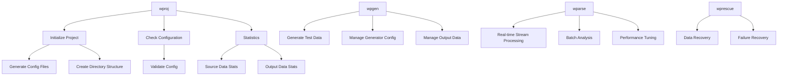

# CLI Tools

This documentation collection introduces the complete command-line toolset provided by WarpParse, including data parsing, generation, and project management functions.

## Tool Overview

### Core Tools

| Tool | Description | Main Purpose |
|------|-------------|--------------|
| **wparse** | Data parsing engine | Real-time data stream processing, batch analysis |
| **wpgen** | Data generator | Generate test data based on rules or samples |
| **wproj** | Project management tool | Project initialization, configuration management, data statistics |
| **wprescue** | Data recovery tool | Recover failed data from rescue directory |

## Quick Reference

### wparse - Data Parsing Engine

```bash
# Daemon mode (persistent service)
wparse daemon --work-root ./myproject --stat-print

# Batch processing mode
wparse batch --work-root ./myproject --max-line 10000 --stat 5
```

### wpgen - Data Generator

```bash
# Generate data based on rules
wpgen rule --work-root ./myproject --print-stat --line-cnt 10000

# Generate data from samples
wpgen sample --work-root ./myproject --line-cnt 5000

# Configuration management
wpgen conf init
wpgen conf check
wpgen conf clean

# Data management
wpgen data clean
wpgen data check
```

### wproj - Project Management Tool

```bash
# Project initialization
wproj init --mode full

# Project check
wproj check

# Data cleanup
wproj data clean

# Statistics
wproj stat file
wproj stat file --output json

# Model management
wproj model list
wproj model validate

# Rule tools
wproj rule parse --rule-id myrule
wproj rule test --input sample.log

# Configuration management
wproj sinks list
wproj sinks validate
wproj sinks route
```

### wprescue - Data Recovery Tool

```bash
# Batch mode data recovery
wprescue batch --work-root ./myproject
```

## Tool Relationship Diagram



## Quick Start

### 1. Initialize Project

```bash
# Full initialization with configuration and templates
wproj init --mode full
wproj check
```

### 2. Generate Test Data

```bash
# Generate test data (10000 lines, 3-second stats interval)
wpgen rule -n 10000 --stat 3
```

### 3. Run Parsing

```bash
# Batch processing mode
wparse batch --stat 5 -p

# Or use daemon mode (persistent service)
wparse daemon --stat-print
```

### 4. View Statistics

```bash
# Statistics for sources and file-type sinks
wproj stat file

# Output in JSON format
wproj stat file --output json
```

## Learning Path

1. **Beginners**: Start with [Getting Started Guide](./01-getting_started.md) to understand the complete configuration and usage flow
2. **Advanced Users**: Study [wparse](./03-wparse.md) in depth to understand the two running modes and their use cases
3. **Data Engineers**: Master [wpgen Usage Guide](./04-wpgen.md) to generate various test data
4. **Operations**: Use [wproj Project Management](./02-wproj.md) for daily project management and monitoring
5. **Troubleshooting**: Refer to [wprescue Data Recovery](./05-wprescue.md) for handling exceptions

## Common Use Cases

### Real-time Stream Processing

```bash
# Start daemon for continuous data stream processing
wparse daemon \
  --work-root ./myproject \
  --stat-print \
  --robust online
```

### Batch Data Analysis

```bash
# Batch analysis of historical data
wparse batch \
  --work-root ./myproject \
  --max-line 100000 \
  --check-continue 1000 \
  --stat 10
```

### Development Testing

```bash
# Development mode with detailed logging
wparse batch \
  --work-root ./myproject \
  --log-profile dev \
  --max-line 100 \
  --stat 1
```

### Test Data Generation

```bash
# Generate test data for specific scenarios
wpgen rule \
  --work-root ./myproject \
  --conf-name test.toml \
  --line-cnt 10000 \
  --gen-speed 1000
```

## Troubleshooting

### Common Issues

1. **Configuration file not found**
   - Ensure you're running commands in the correct working directory
   - Use `--work-root` parameter to specify the working directory

2. **Permission errors**
   - Check write permissions for working and log directories
   - Ensure sufficient disk space

3. **Out of memory**
   - Reduce `--max-line` or `--parse-workers` parameter values
   - Use `--robust` parameter to set appropriate robustness mode

4. **Data source connection failed**
   - Check connector configuration in `connectors/source.d/` directory
   - Verify network connectivity and authentication information

### Log Analysis

```bash
# View real-time logs
tail -f logs/wparse.log

# Search error logs
grep -i error logs/*.log

# Use wproj for project check
wproj check --work-root ./myproject
```

## Version Information

Check tool versions:

```bash
wparse --version
wpgen --version
wproj --version
wprescue --version
```

## Environment Variables

| Variable | Description |
|----------|-------------|
| `WP_PARSE_ROBUST` | Set global robustness mode |
| `WP_PARSE_LOG_LEVEL` | Override log level |
| `RUST_LOG` | Rust log level (for debugging) |

## Exit Codes

| Exit Code | Meaning |
|-----------|---------|
| 0 | Success |
| 1 | General error |
| 2 | Configuration error |
| 3 | Data error |
| 4 | Network error |
| 5 | Permission error |

## Technical Architecture

The CLI tools are written in Rust, using the clap framework for command-line argument handling and tokio async runtime. Core functionality is exposed through the `wp-engine` library's facade pattern, ensuring API stability and backward compatibility.

### Project Structure

```
warp-parse/
├── src/
│   ├── wparse/          # Data parsing engine
│   │   └── main.rs
│   ├── wpgen/           # Data generator
│   │   ├── main.rs
│   │   ├── cli.rs       # CLI definition
│   │   ├── rule.rs      # Rule generation logic
│   │   ├── sample.rs    # Sample generation logic
│   │   ├── conf.rs      # Configuration management
│   │   └── data.rs      # Data management
│   ├── wproj/           # Project management
│   │   └── main.rs
│   └── wprescue/        # Data recovery
│       └── main.rs
└── wp-engine/           # Core engine library
    └── facade/args.rs   # Parameter definitions
```

This design ensures:
1. **Modularity**: Each tool has a single responsibility, easy to maintain
2. **Reusability**: Core functionality is shared through libraries
3. **Extensibility**: Easy to add new CLI tools

## Related Links

- [Project Homepage](https://github.com/wp-labs/warp-parse)
- [Downloads](https://github.com/wp-labs/warp-parse/releases)
- [Configuration Reference](../02-config/)
- [User Documentation](../)
