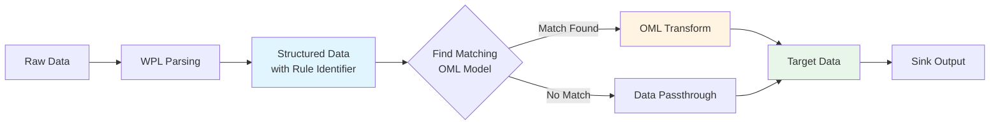
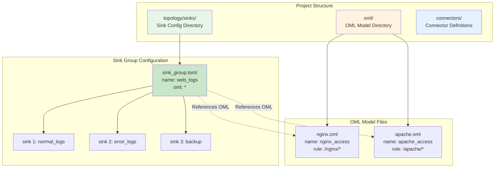

# OML Applications

## Table of Contents

1. [Core Concepts](#core-concepts)
2. [Configuration Structure](#configuration-structure)
3. [OML and Sink Group Association](#oml-and-sink-group-association)
4. [Conditional Routing](#conditional-routing)
5. [Complete Examples](#complete-examples)
6. [Workflow](#workflow)
7. [Troubleshooting](#troubleshooting)
8. [Best Practices](#best-practices)

## Core Concepts

### Role of OML in Data Flow

In the WP Engine data processing pipeline, OML serves as the **data transformation engine**:



### Key Concepts

- **WPL Rule (Rule Path)**: Identifies data source and type (e.g., `/nginx/access_log`)
- **OML Model (Object Model)**: OML configuration file defining how to transform data
- **Sink Group (Output Group)**: Defines the target collection for data output
- **Rule Matching**: Associates WPL Rules with OML Models through wildcards

## Configuration Structure

### Configuration File Relationships



### Sink Group Configuration File

Sink Group configuration files are typically located in the `topology/sinks/` directory, using TOML format:

```toml
version = "2.0"

[sink_group]
name = "business_logs"        # Output group name
oml = ["*"]                   # Associated OML models (wildcard)
rule = []                     # Optional: Restrict WPL rules to process
parallel = 1                  # Optional: Parallelism (default 1)
tags = ["env:prod"]           # Optional: Group-level tags

[[sink_group.sinks]]
name = "error_logs"
connect = "file_json_sink"    # Connector ID
tags = ["type:error"]         # Optional: Sink-level tags

[sink_group.sinks.params]
file = "error.json"
```

### OML Model File

OML model files are typically located in the `oml/` directory, using the `.oml` extension:

```oml
name : nginx_access
rule : /nginx/*           # Matching WPL rule (wildcard)
---
# Field transformation definitions
user_id : chars = take(user_id);
occur_time : time = take(time);
status : digit = take(status_code) { _ : digit(0) };
uri : chars = take(request_uri);
```

## OML and Sink Group Association

### Association Methods

Sink Groups establish associations with OML models through the `oml` field:


#### 1. Specify Model Names

```toml
[sink_group]
name = "nginx_logs"
oml = ["nginx_access", "nginx_error"]  # Only use these OML models
```

**How it works**:
- Only searches for matches within the specified OML model list
- Suitable for scenarios where you know exactly which OML models are needed

#### 2. Empty List (Passthrough)

```toml
[sink_group]
name = "raw_logs"
oml = []  # Don't use any OML transformation
```

**How it works**:
- Data passes through without OML transformation
- Suitable for scenarios that don't require data transformation

### Matching Rules

**OML Model Matching Logic**:


**Examples**:

| OML rule Field | Data WPL Rule | Match Result |
|----------------|---------------|--------------|
| `/nginx/*` | `/nginx/access_log` | ✅ Match |
| `/nginx/*` | `/nginx/error_log` | ✅ Match |
| `/nginx/access*` | `/nginx/access_log` | ✅ Match |
| `/nginx/access*` | `/nginx/error_log` | ❌ No Match |
| `*` | Any rule | ✅ Match |
